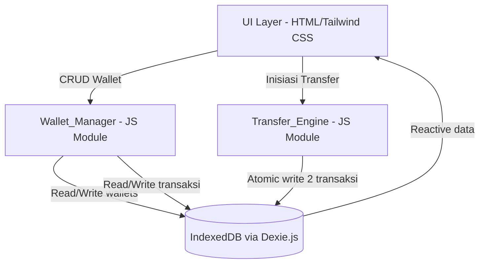

# Design Document: Financial Management Features (Multi-Wallet)

## Overview

Fitur Multi-Wallet menambahkan kemampuan manajemen sumber dana ke aplikasi KeuanganKu yang sudah ada. Pengguna dapat membuat beberapa wallet (Tunai, BCA, GoPay, OVO, dll.), mengaitkan setiap transaksi ke wallet tertentu, melihat saldo per wallet di dashboard, dan melakukan transfer antar wallet.

Seluruh implementasi berjalan **offline-first** menggunakan IndexedDB via Dexie.js — konsisten dengan arsitektur aplikasi yang sudah ada di `index.html`. Tidak ada perubahan pada infrastruktur backend karena aplikasi ini adalah single-file PWA.

### Keputusan Desain Utama

- **Satu file HTML**: Semua logika ditambahkan ke `index.html` yang sudah ada, mengikuti pola yang sudah ada.
- **Dexie.js version upgrade**: Skema database di-upgrade dari versi 2 ke versi 3 untuk menambahkan tabel `wallets` dan field `walletId` pada tabel `transaksi`.
- **Transfer sebagai dua transaksi**: Transfer direpresentasikan sebagai dua transaksi terkait (bukan tabel terpisah), dengan field `transferPairId` untuk menghubungkan keduanya.
- **Migrasi data otomatis**: Transaksi lama tanpa `walletId` secara otomatis diasosiasikan ke wallet default "Tunai" saat upgrade skema.

---

## Architecture

Aplikasi ini adalah **single-page application (SPA) berbasis satu file HTML** dengan arsitektur sebagai berikut:



### Alur Data

1. **Inisialisasi**: Saat `loadData()` dipanggil, semua data wallet dan transaksi dimuat dari IndexedDB ke memori (`wallets[]`, `transaksi[]`).
2. **Mutasi**: Setiap operasi CRUD memanggil Dexie API, lalu memanggil `loadData()` untuk me-refresh state.
3. **Rendering**: Fungsi render membaca dari state in-memory dan memperbarui DOM.

---

## Components and Interfaces

### Wallet_Manager

Modul JavaScript yang menangani semua operasi CRUD pada tabel `wallets`.

```javascript
// Interface Wallet_Manager
async function createWallet(wallet)       // Returns: {success, error?}
async function updateWallet(id, changes)  // Returns: {success, error?}
async function deleteWallet(id)           // Cascade delete transaksi terkait
async function getWallets()               // Returns: Wallet[]
async function getDefaultWallet()         // Returns: Wallet (wallet "Tunai")
async function initDefaultWallet()        // Buat "Tunai" jika belum ada wallet
```

**Validasi di `createWallet`**:
- Nama tidak boleh kosong
- Nama tidak boleh duplikat (case-insensitive check terhadap semua wallet yang ada)

**Cascade delete di `deleteWallet`**:
- Hapus semua transaksi dengan `walletId === id`
- Hapus wallet itu sendiri
- Operasi dilakukan dalam satu Dexie transaction untuk atomicity

### Transfer_Engine

Modul JavaScript yang menangani operasi transfer antar wallet.

```javascript
// Interface Transfer_Engine
async function createTransfer(transfer)   // Returns: {success, error?}
async function deleteTransfer(transaksiId) // Hapus kedua pasangan transfer
```

**Validasi di `createTransfer`**:
- `fromWalletId !== toWalletId`
- `amount > 0`

**Atomicity di `createTransfer`**:
- Menggunakan `db.transaction('rw', db.transaksi, ...)` untuk memastikan kedua transaksi dibuat atau tidak sama sekali.

### Dashboard Extensions

Ekstensi pada fungsi-fungsi rendering yang sudah ada:

```javascript
function renderWalletCards()          // Render kartu saldo per wallet
function updateSummary()              // Diperluas: hitung total dari semua wallet
function renderList()                 // Diperluas: tambah filter wallet
function calculateWalletBalance(id)   // Hitung saldo untuk satu wallet
```

---

## Data Models

### Tabel `wallets` (Baru)

```javascript
// Dexie schema: '++id, nama'
{
  id: number,          // Auto-increment primary key
  nama: string,        // Wajib, unik (case-insensitive)
  ikon: string,        // Emoji, opsional (default: '💰')
  warna: string,       // Hex color, opsional (default: '#1e40af')
  urutan: number       // Urutan tampilan di dashboard
}
```

### Tabel `transaksi` (Diperluas)

Field baru yang ditambahkan ke skema yang sudah ada:

```javascript
// Skema lama: '++id, deskripsi, jenis, kategori, jumlah, tanggal'
// Skema baru: '++id, deskripsi, jenis, kategori, jumlah, tanggal, walletId, transferPairId'
{
  id: number,
  deskripsi: string,
  jenis: 'income' | 'expense',
  kategori: string,        // 'Transfer' untuk transaksi hasil transfer
  jumlah: number,
  tanggal: string,         // Format YYYY-MM-DD
  walletId: number,        // FK ke wallets.id (nullable untuk data lama)
  transferPairId: number   // ID transaksi pasangan (nullable, hanya untuk transfer)
}
```

### Dexie Schema Upgrade

```javascript
// Versi 3 - tambah tabel wallets dan index baru di transaksi
db.version(3).stores({
  transaksi: '++id, deskripsi, jenis, kategori, jumlah, tanggal, walletId, transferPairId',
  budgets: '++id, kategori, limit_amount',
  debts: '++id, nama, keterangan, jenis, jumlah, tanggal_tenggat, status',
  wallets: '++id, nama'
}).upgrade(async tx => {
  // Buat wallet default "Tunai"
  const tunaiId = await tx.table('wallets').add({
    nama: 'Tunai', ikon: '💵', warna: '#059669', urutan: 0
  });
  // Migrasi: asosiasikan semua transaksi lama ke wallet "Tunai"
  await tx.table('transaksi').toCollection().modify(t => {
    if (!t.walletId) t.walletId = tunaiId;
  });
});
```

### Backup JSON Format (Diperluas)

```json
{
  "metadata": {
    "version": 3,
    "exported_at": "ISO-8601",
    "app": "KeuanganKu"
  },
  "data": {
    "wallets": [...],
    "transaksi": [...],
    "budgets": [...],
    "debts": [...]
  }
}
```

---

## Correctness Properties

*A property is a characteristic or behavior that should hold true across all valid executions of a system — essentially, a formal statement about what the system should do. Properties serve as the bridge between human-readable specifications and machine-verifiable correctness guarantees.*

### Property 1: Wallet Persistence Round-Trip

*For any* wallet object dengan nama valid (non-empty, unik), menyimpan wallet ke IndexedDB lalu membacanya kembali harus menghasilkan objek yang identik dengan atribut yang sama (nama, ikon, warna, urutan).

**Validates: Requirements 1.1, 6.1**

---

### Property 2: Duplicate Wallet Name Rejection

*For any* nama wallet yang sudah ada di database, mencoba membuat wallet baru dengan nama yang sama (termasuk variasi kapitalisasi) harus ditolak dan jumlah total wallet tidak boleh bertambah.

**Validates: Requirements 1.2**

---

### Property 3: Cascade Delete Wallet and Transactions

*For any* wallet yang memiliki sejumlah transaksi terkait, menghapus wallet tersebut harus mengakibatkan wallet dan semua transaksi yang memiliki `walletId` tersebut tidak lagi ada di database.

**Validates: Requirements 1.4**

---

### Property 4: Transaction WalletId Persistence

*For any* transaksi dengan `walletId` yang valid, menyimpan transaksi lalu membacanya kembali harus menghasilkan transaksi dengan `walletId` yang sama. Begitu pula saat `walletId` diubah melalui operasi update.

**Validates: Requirements 2.1, 2.3**

---

### Property 5: Orphan Transaction Migration

*For any* kumpulan transaksi yang memiliki `walletId` bernilai null atau merujuk ke wallet yang tidak ada, menjalankan proses migrasi harus mengakibatkan semua transaksi tersebut memiliki `walletId` yang menunjuk ke wallet default "Tunai".

**Validates: Requirements 2.4**

---

### Property 6: Total Balance Equals Sum of Wallet Balances

*For any* kumpulan wallet dan transaksi, total saldo gabungan yang ditampilkan di dashboard harus selalu sama dengan jumlah saldo individual dari semua wallet yang ada.

**Validates: Requirements 3.3**

---

### Property 7: Same-Wallet Transfer Rejection

*For any* wallet, mencoba membuat transfer dengan wallet asal dan wallet tujuan yang sama harus selalu ditolak dan tidak ada transaksi baru yang dibuat.

**Validates: Requirements 4.2**

---

### Property 8: Transfer Creates Paired Transactions

*For any* transfer yang valid (wallet asal ≠ wallet tujuan, nominal > 0), mengeksekusi transfer harus menghasilkan tepat dua transaksi baru: satu transaksi `expense` di wallet asal dan satu transaksi `income` di wallet tujuan, keduanya dengan nominal dan tanggal yang sama, kategori "Transfer", dan `transferPairId` yang saling merujuk satu sama lain.

**Validates: Requirements 4.3, 4.4**

---

### Property 9: Transfer Pair Deletion

*For any* transaksi yang merupakan bagian dari transfer (memiliki `transferPairId`), menghapus transaksi tersebut harus mengakibatkan transaksi pasangannya juga terhapus dari database.

**Validates: Requirements 4.5**

---

### Property 10: Wallet Filter Correctness

*For any* wallet yang dipilih sebagai filter, semua transaksi yang ditampilkan dalam daftar riwayat harus memiliki `walletId` yang sama dengan wallet yang difilter, dan tidak ada transaksi dari wallet lain yang muncul.

**Validates: Requirements 5.2**

---

### Property 11: Backup/Restore Round-Trip

*For any* state database yang berisi wallets, transaksi, budgets, dan debts, melakukan backup lalu restore harus menghasilkan state database yang identik dengan state sebelum backup (semua data terpulihkan dengan benar termasuk asosiasi `walletId`).

**Validates: Requirements 6.2, 6.3**

---

## Error Handling

| Skenario | Penanganan |
|---|---|
| Nama wallet duplikat | Tampilkan pesan error inline: "Nama wallet sudah digunakan" |
| Transfer wallet sama | Tampilkan pesan error inline: "Wallet asal dan tujuan tidak boleh sama" |
| Hapus wallet dengan transaksi | Tampilkan dialog konfirmasi sebelum cascade delete |
| Dexie transaction gagal (transfer) | Rollback otomatis oleh Dexie, tampilkan alert error |
| Restore file JSON tidak valid | Tampilkan alert: "File backup tidak valid atau tidak dikenali" |
| Restore file JSON lama (tanpa wallets) | Buat wallet "Tunai" dan migrasi semua transaksi ke sana |
| walletId null/invalid saat load | Asosiasikan ke wallet "Tunai" secara silent |

---

## Testing Strategy

### Pendekatan Dual Testing

Strategi pengujian menggunakan dua pendekatan yang saling melengkapi:

1. **Unit Tests** — untuk contoh spesifik, edge case, dan kondisi error
2. **Property-Based Tests** — untuk memverifikasi properti universal di berbagai input

### Unit Tests

Fokus pada:
- Inisialisasi wallet default "Tunai" saat database kosong (Requirement 1.5)
- Tampilan filter wallet dengan opsi "Semua Wallet" sebagai default (Requirement 5.1)
- Restore dari file JSON lama tanpa data `wallets` (edge case Requirement 6.4)
- Format backup JSON mengandung field `wallets` dan `walletId` (Requirement 6.2)

### Property-Based Tests

Library yang digunakan: **[fast-check](https://github.com/dubzzz/fast-check)** (JavaScript)

Konfigurasi: minimum **100 iterasi** per property test.

Setiap property test harus diberi tag komentar dengan format:
```
// Feature: financial-management-features, Property {N}: {deskripsi singkat}
```

Pemetaan property ke test:

| Property | Test | Tag |
|---|---|---|
| P1: Wallet Persistence Round-Trip | `fc.property(walletArb, async (w) => saveAndRead(w) deepEquals w)` | `Property 1` |
| P2: Duplicate Name Rejection | `fc.property(walletNameArb, async (name) => createTwice(name).count === 1)` | `Property 2` |
| P3: Cascade Delete | `fc.property(walletWithTxArb, async (data) => afterDelete(data).txCount === 0)` | `Property 3` |
| P4: Transaction WalletId | `fc.property(txArb, walletArb, async (tx, w) => saveAndRead(tx).walletId === w.id)` | `Property 4` |
| P5: Orphan Migration | `fc.property(orphanTxArb, async (txs) => afterMigrate(txs).all(t => t.walletId === tunaiId))` | `Property 5` |
| P6: Total Balance Invariant | `fc.property(walletsArb, txsArb, (ws, txs) => totalBalance(ws, txs) === sumBalances(ws, txs))` | `Property 6` |
| P7: Same-Wallet Rejection | `fc.property(walletArb, (w) => createTransfer(w, w).isError)` | `Property 7` |
| P8: Transfer Pair Creation | `fc.property(transferArb, async (t) => checkPairedTx(t))` | `Property 8` |
| P9: Transfer Pair Deletion | `fc.property(transferArb, async (t) => afterDeleteOne(t).count === 0)` | `Property 9` |
| P10: Filter Correctness | `fc.property(walletArb, txsArb, (w, txs) => filter(txs, w).all(t => t.walletId === w.id))` | `Property 10` |
| P11: Backup/Restore Round-Trip | `fc.property(dbStateArb, async (s) => restore(backup(s)) deepEquals s)` | `Property 11` |

### Catatan Implementasi

- Karena aplikasi berjalan di browser (IndexedDB), property tests untuk operasi DB perlu menggunakan **fake IndexedDB** (library `fake-indexeddb`) agar bisa dijalankan di Node.js environment.
- Fungsi-fungsi logika bisnis (kalkulasi saldo, validasi, filter) sebaiknya diekstrak sebagai **pure functions** terpisah dari DOM manipulation agar mudah diuji.
- Transfer atomicity diuji dengan mensimulasikan kegagalan di tengah operasi dan memverifikasi tidak ada transaksi parsial yang tersimpan.
